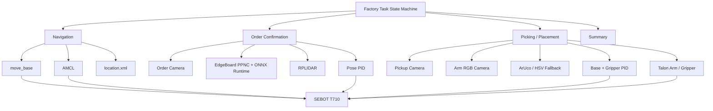
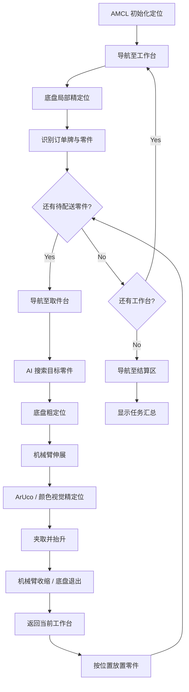

# 🤖 ROS 1 Autonomous Service Robot

> 基于 **SEBOT T710 实机平台** 的 ROS 1 自主服务机器人系统，集成自主探索建图、定位导航、订单识别、零件抓取、物料配送与结果汇总。

<p align="left">
  
  
  
  
  
</p>

## 🎬 Demo

▶ **Bilibili：** https://www.bilibili.com/video/BV1tzgR6hEmd/

---

## 📖 Overview

本项目面向室内服务与物料配送场景，将移动机器人导航、视觉感知和机械操作串联成完整的自主任务闭环：

```text
未知环境
   ↓
自主探索建图
   ↓
AMCL 定位 / move_base 导航
   ↓
工作台订单识别
   ↓
取件台零件搜索与精定位
   ↓
机械臂抓取
   ↓
返回工作台并放置
   ↓
多任务循环
   ↓
结算区结果汇总
```

系统由三个主要工作空间组成：

| 模块 | 作用 |
| --- | --- |
| `sebot_factory` | 上层任务状态机、订单确认、智能取件、零件放置与结果汇总 |
| `sebot_ros_kits` | 底盘驱动、TF、传感器、SLAM、AMCL、Navigation、语音等基础能力 |
| `sebot_ros_stdr` | STDR 仿真与导航测试 |

> [!NOTE]
> 本仓库是基于 SEBOT T710 实机平台及其 ROS 软件栈整理的工程项目。仓库中同时包含平台基础功能包与任务层代码，部分源码保留原作者及版权信息。本文档按当前仓库源码说明系统结构与实机任务流程，不将平台已有组件归为个人独立实现。

---

## ✨ Features

- **自主探索建图**：GMapping + Frontier Search + move_base，实现未知环境自动探索、失败目标黑名单与探索结束自动返航。
- **自主定位导航**：AMCL + move_base，支持工作台、取件台、结算区之间的连续任务导航。
- **订单视觉识别**：先检测订单牌区域，再筛选订单框内部零件，减少背景目标干扰。
- **多帧结果确认**：累计多帧检测结果，根据出现次数和置信度确认订单内容，并按图像纵向位置排序。
- **工作台精定位**：结合激光雷达左右距离、前向距离和订单牌图像位置，通过 PID 修正底盘姿态。
- **双阶段取件定位**：AI 视觉完成目标搜索与底盘粗定位，机械臂 RGB 相机完成末端精对准。
- **ArUco + 颜色兜底**：优先使用 ArUco 标记定位；未识别到标记时使用 HSV 蓝色区域进行辅助定位。
- **机械臂串口控制**：通过 `/dev/talon` 与机械臂控制器通信，完成伸展、抓取、抬升、收缩与放置。
- **多任务状态机**：按“工作台 → 取件台 → 工作台”循环执行多个订单，任务结束后前往结算区。
- **结果可视化**：根据任务过程中保存的订单数据生成并显示最终物料汇总界面。
- **语音反馈**：通过 ROS `/audio` 话题播报建图、导航、取件和配送状态。

---

## 🧠 System Architecture



任务层由 `Factory` 状态机统一调度：

```text
FACTORY_STEP_START
        ↓
FACTORY_STEP_INIT
        ↓
FACTORY_STEP_DELIVERY
        ↓
FACTORY_STEP_SUMMARY
        ↓
FACTORY_STEP_END
```

---

## 🗺️ Autonomous Mapping

`sebot_slam` 中的自主探索节点基于代价地图执行 Frontier Search：

1. 从机器人附近可通行栅格开始 BFS 搜索；
2. 将“未知栅格且邻接自由空间”的区域构造成 Frontier；
3. 过滤过小 Frontier；
4. 根据距离与 Frontier 大小计算代价并排序；
5. 选择当前代价较低且未进入黑名单的 Frontier 质心作为 `move_base` 目标；
6. 若机器人长时间无进展或导航失败，将目标加入黑名单并重新规划；
7. 所有 Frontier 探索完成后返回初始位置并触发地图保存。

源码中的 Frontier 代价形式为：

```text
cost = potential_scale × min_distance × resolution
     - gain_scale × frontier_size × resolution
```

对应流程：

```text
RPLIDAR + Odometry + IMU
          ↓
       GMapping
          ↓
     Costmap2D
          ↓
   Frontier Search
          ↓
  Frontier Cost Sort
          ↓
      move_base
      ↙      ↘
   成功       超时/失败
    ↓           ↓
新 Frontier   Blacklist
      ↘       ↙
       继续探索
          ↓
      Frontier 清空
          ↓
       返回起点
          ↓
       保存地图
```

---

## 🚚 Autonomous Delivery Workflow

地图建立后，系统进入基于已知地图的配送任务：



工作台、取件台、起始点与结算区坐标由：

```text
sebot_factory/src/sebot_factory/res/location.xml
```

统一配置，并在任务启动时解析为 `move_base` 导航目标。

---

## 👁️ Order Recognition

订单识别由 `Confirm` 状态机完成：

```text
CONFIRM_STEP_START
        ↓
CONFIRM_STEP_POSE
        ↓
CONFIRM_STEP_PART
        ↓
CONFIRM_STEP_END
```

### 1. 工作台姿态修正

机器人到达工作台附近后，不直接开始识别，而是进一步进行局部位置校正：

```text
激光左右距离差 ──→ 朝向 PID
激光前向距离   ──→ 前后距离 PID
订单牌图像中心 ──→ 横向位置 PID
```

这样可以将全局导航的“到达工作台附近”进一步收敛到适合识别与操作的位置。

### 2. 订单区域约束

视觉模块首先检测 `order` 区域，再只保留**中心点位于订单框内部**的零件目标，从而降低环境中同类物体对订单识别的影响。

当前标签包括：

| Label | 含义 |
| --- | --- |
| `order` | 订单区域 |
| `nut` | 螺母 |
| `screw` | 螺钉 |
| `pcb` | 电路板 |
| `block` | 端子排 |
| `tape` | 绝缘胶带 |

### 3. 多帧确认

系统会累计多轮检测结果：

- 对各类别出现次数进行统计；
- 对同类目标保留较高置信度结果；
- 达到重复出现阈值后才进入最终订单；
- 最终按照目标在订单牌中的 Y 轴位置从上到下排序。

相比直接采用单帧检测结果，这种方式可以降低偶发误检对任务状态机的影响。

---

## 🧩 Edge AI Inference Pipeline

视觉检测封装在 `Detection` 类中，推理链路为：

```text
Camera Frame
    ↓
Resize 320 × 320
    ↓
BGR → RGB
    ↓
Normalize / CHW
    ↓
EdgeBoard PPNC NNA
    ↓
ONNX Runtime Post-processing
    ↓
NMS
    ↓
Detection Results
```

主要依赖：

- OpenCV
- PPNC / EdgeBoard NNA Runtime
- ONNX Runtime
- 自定义 NMS 运行模块

---

## 🦾 Visual Picking

`Picking` 模块采用“**移动底盘粗定位 + 机械臂末端视觉精定位**”的两级策略。

### Picking State Machine

```text
PICK_STEP_START
      ↓
PICK_STEP_POSE
      ↓
PICK_STEP_SEARCH
      ↓
PICK_STEP_FORWARD
      ↓
PICK_STEP_AIM
      ↓
PICK_STEP_GRAB
      ↓
PICK_STEP_LOCAL
      ↓
PICK_STEP_END
```

### Stage 1 — Target Search & Base Alignment

取件台阶段首先使用 AI 相机搜索指定零件，并结合激光雷达与视觉中心误差调整：

- 前后距离；
- 底盘朝向；
- 横向位置。

若暂时未检测到目标，机器人会在一定范围内移动搜索；稳定检测到目标后进入机械臂精定位阶段。

### Stage 2 — End-effector Alignment

机械臂伸展后切换 RGB 相机：

1. 使用 `DICT_4X4_50` ArUco 字典检测目标标记；
2. 选择目标标记并计算相对图像中心偏差；
3. 若未检测到 ArUco，则在 HSV 空间搜索蓝色区域作为兜底；
4. 通过机械爪 PID 修正末端位置；
5. 底盘低速靠近至抓取距离；
6. 夹爪闭合并抬升物料；
7. 机械臂收缩，同时底盘退出取件区域。

机械臂由自定义串口协议直接控制，而不是通过 MoveIt 执行规划。默认串口：

```text
/dev/talon
```

动作组包括：

```text
ACTION_RES  → Reset / 复位
ACTION_EXT  → Extend / 伸展
ACTION_CUR  → Retract / 收缩
ACTION_PUT  → Place / 放置
ACTION_DIY  → Custom / 自定义动作
```

---

## 📦 Placement

机器人抓取零件后返回对应工作台，并根据当前零件序号选择放置位置：

| 序号 | 放置区域 |
| --- | --- |
| 1 | 中间 |
| 2 | 左侧 |
| 3 | 右侧 |

放置过程包含距离调整、机械臂放置动作、末端横向偏移、夹爪释放、抬升、底盘后退与机械臂收缩。

---

## 🧾 Task Summary

任务过程中，`Factory` 会保存各工作台识别到的订单信息。所有配送任务结束后，机器人导航至结算区，由 `Summary` 模块根据订单数据拼接并显示最终结果界面。

物料编号映射：

| Part | Code |
| --- | --- |
| Screw | `G111` |
| Nut | `G112` |
| PCB | `G113` |
| Block | `G114` |
| Tape | `G115` |

---

## 🛠 Tech Stack

| Layer | Technologies |
| --- | --- |
| Robot Middleware | ROS 1, catkin, TF, actionlib |
| SLAM | GMapping, custom Frontier Search, costmap_2d |
| Navigation | AMCL, move_base, map_server |
| State Estimation | Odometry, IMU, robot_pose_ekf |
| Vision | OpenCV, ArUco |
| AI Inference | EdgeBoard PPNC / NNA, ONNX Runtime |
| Motion Control | `/cmd_vel`, PID control |
| Manipulation | Talon arm, gripper, libserial |
| Sensors | RPLIDAR, USB cameras |
| Languages | C++, Python |

> `sebot_factory/src/sebot_factory/CMakeLists.txt` 同时存在 C++14 标准设置与 `-std=c++11` 编译参数；若后续维护，建议统一编译标准。

---

## 📁 Repository Structure

```text
ros1-autonomous-service-robot/
│
├── sebot_factory/                       # 上层任务工作空间
│   └── src/
│       └── sebot_factory/
│           ├── src/
│           │   ├── factory.cpp          # 总任务状态机
│           │   ├── confirm.cpp          # 工作台定位与订单确认
│           │   ├── picking.cpp          # 搜索、抓取与放置
│           │   └── summary.cpp          # 任务结果汇总
│           ├── include/
│           │   ├── detection.hpp        # Edge AI 检测封装
│           │   ├── arm.hpp              # Talon 机械臂串口控制
│           │   └── tools.hpp
│           ├── launch/
│           │   └── sebot_factory.launch
│           ├── res/
│           │   ├── location.xml         # 场景导航点
│           │   ├── model/               # 推理配置与模型资源
│           │   └── image/               # 汇总界面资源
│           └── unit/                     # 单模块测试程序
│
├── sebot_ros_kits/                      # 平台 ROS 基础工作空间
│   └── src/
│       ├── sebot_driver/
│       ├── sebot_navigation/
│       ├── sebot_robot/
│       ├── sebot_slam/
│       ├── sebot_speech/
│       └── sebot_visions/
│
├── sebot_ros_stdr/                      # STDR 仿真工作空间
│   └── src/
│       └── sebot_stdr/
│
├── .gitattributes
└── README.md
```

---

## 🚀 Quick Start

### 1. Clone

```bash
git clone https://github.com/Luky-hui/ros1-autonomous-service-robot.git
cd ros1-autonomous-service-robot
```

### 2. Check platform dependencies

该项目依赖 SEBOT T710 实机环境和 EdgeBoard 推理运行时，除常规 ROS 1 Navigation 组件外，还需要正确安装/配置：

- `rplidar_ros`
- `robot_pose_ekf`
- OpenCV
- `libserial`
- PPNC / EdgeBoard runtime
- ONNX Runtime
- 对应底盘、机械臂和摄像头设备规则

### 3. Fix the model path before running

当前源码中的：

```text
sebot_factory/src/sebot_factory/res/model/config_ppncnna.json
```

仍保留旧工程的绝对路径：

```text
/root/workspace/sebot-t710-competition/sebot_factory/src/sebot_factory/res/model
```

请修改为当前设备上的实际路径，例如：

```text
/root/workspace/ros1-autonomous-service-robot/sebot_factory/src/sebot_factory/res/model
```

如果仓库不位于 `/root/workspace/`，应替换为你的真实路径。

### 4. Build robot workspace

```bash
cd sebot_ros_kits
catkin_make
source devel/setup.bash
```

### 5. Build task workspace

```bash
cd ../sebot_factory
catkin_make
source devel/setup.bash
```

### 6. Autonomous mapping

```bash
source sebot_ros_kits/devel/setup.bash
roslaunch sebot_slam sebot_auto_gmapping.launch
```

探索结束后，自主建图节点会返回起始位置并触发 `sebot_map_save.launch` 保存地图。

如需手动保存地图：

```bash
roslaunch sebot_slam sebot_map_save.launch
```

### 7. Run delivery task

```bash
source sebot_ros_kits/devel/setup.bash
source sebot_factory/devel/setup.bash
roslaunch sebot_factory sebot_factory.launch
```

该 launch 会启动机器人控制、里程计/IMU 融合、RPLIDAR、地图服务、AMCL、move_base、RViz、语音节点以及 `sebot_factory` 主任务节点。

---

## 🔌 Runtime Interfaces

| Interface | Usage |
| --- | --- |
| `/scan` | 激光雷达数据 |
| `/cmd_vel` | 底盘速度控制 |
| `/initialpose` | AMCL 初始位姿 |
| `/amcl_pose` | AMCL 定位结果 |
| `move_base` | 导航 Action |
| `/move_base/clear_costmaps` | 清理导航代价地图 |
| `/audio` | 任务语音提示 |
| `/dev/talon` | Talon 机械臂串口 |
| `/dev/deepCamera` | 订单 / 取件视觉相机兜底设备名 |
| `/dev/rgbCamera` | 机械臂 RGB 相机兜底设备名 |

---

## ⚙️ Configuration

常用配置位置：

```text
sebot_factory/src/sebot_factory/res/location.xml
    └── 工作台、取件台、起始点、结算区坐标

sebot_factory/src/sebot_factory/launch/sebot_factory.launch
    └── PID、AI 置信度、距离阈值、导航超时等任务参数

sebot_factory/src/sebot_factory/res/model/
    └── NNA / ONNX / NMS 与标签配置

sebot_ros_kits/src/sebot_navigation/
    └── AMCL、move_base、costmap 与地图配置

sebot_ros_kits/src/sebot_slam/
    └── GMapping、自主 Frontier 探索与地图保存
```

---

## ⚠️ Portability Notes

本仓库来自真实机器人运行环境，并非在任意 ROS 设备上 `clone` 后即可直接运行。迁移时尤其需要检查：

1. **模型绝对路径**：`config_ppncnna.json` 仍含旧仓库路径，需要修改。
2. **设备节点**：`/dev/talon`、`/dev/deepCamera`、`/dev/rgbCamera` 依赖目标机器的 udev / USB 映射。
3. **场景坐标**：`location.xml` 中坐标与地图强绑定，更换场地后需要重新标定。
4. **PID 与距离参数**：与底盘、相机安装位置、雷达盲区和机械臂尺寸相关，需要重新调参。
5. **ArUco 配置**：当前抓取逻辑中各零件均使用目标 ArUco ID `1`，换用不同标记方案时应修改映射。
6. **颜色兜底阈值**：蓝色 HSV 阈值依赖光照与相机，需要现场重新标定。
7. **机械臂动作组**：伸展、收缩、放置等动作依赖 Talon 控制器预设动作与当前机械结构。
8. **自动保存地图**：自主建图结束后通过 `gnome-terminal` 启动地图保存，在无桌面环境下需要改为直接启动进程或 ROS service/action 方式。
9. **任务点补偿**：任务流程中存在与具体场地和零件相关的导航位置偏移，迁移场景时应重新验证。

---

## 📌 Repository Scope & Attribution

该仓库用于记录和展示一套基于真实服务机器人平台的 ROS 系统工程，包括：

- SLAM / Navigation 的系统集成与实机运行；
- 订单识别与多帧视觉确认；
- 激光 + 视觉的底盘局部精定位；
- 目标搜索、机械臂视觉对准、抓取和放置；
- 多工作台任务状态机与完整配送流程联调。

仓库中的平台基础功能包及部分源码包含原作者信息和版权声明，请保留相应文件头。若计划进一步分发、修改授权方式或用于商业用途，请先确认各组件的许可与授权范围。

---

## 🎯 What This Project Demonstrates

这个项目的重点不是单个算法 Demo，而是将多个机器人子系统在真实硬件上组织成一个可连续执行的自主任务系统：

```text
SLAM
 + Navigation
 + Localization
 + Computer Vision
 + Edge AI Inference
 + Mobile Base Control
 + Manipulator Control
 + Task State Machine
 = End-to-End Autonomous Service Robot
```

它展示了从**环境建图 → 全局导航 → 局部精定位 → 目标识别 → 机械操作 → 多任务调度 → 结果汇总**的完整机器人软件链路。

